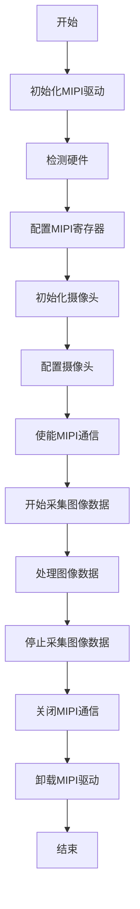

```mermaid
flowchart TB
    A[开始] --> B[初始化MIPI驱动]
    B --> C[检测硬件]
    C --> D[配置MIPI寄存器]
    D --> E[初始化摄像头]
    E --> F[配置摄像头]
    F --> G[使能MIPI通信]
    G --> H[开始采集图像数据]
    H --> I[处理图像数据]
    I --> J[停止采集图像数据]
    J --> K[关闭MIPI通信]
    K --> L[卸载MIPI驱动]
    L --> M[结束]

```

以上是在Linux Kernel下的MIPI驱动流程，您可以根据实际需要进行修改和补充。
